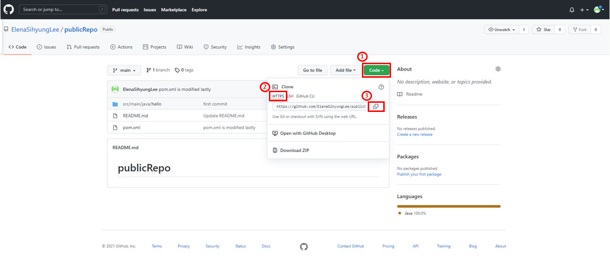
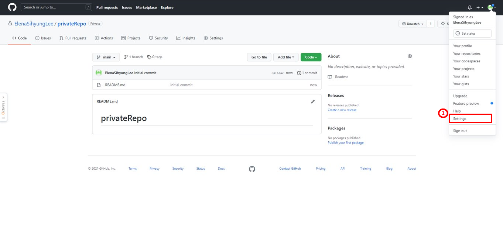
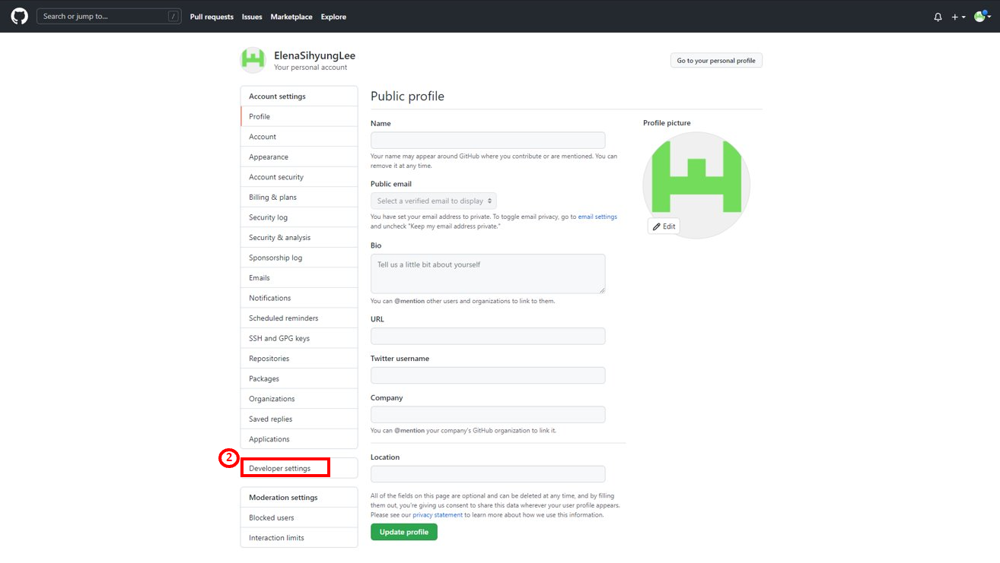
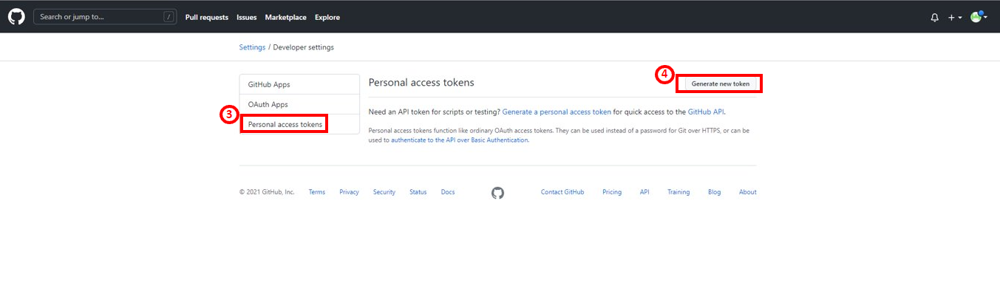
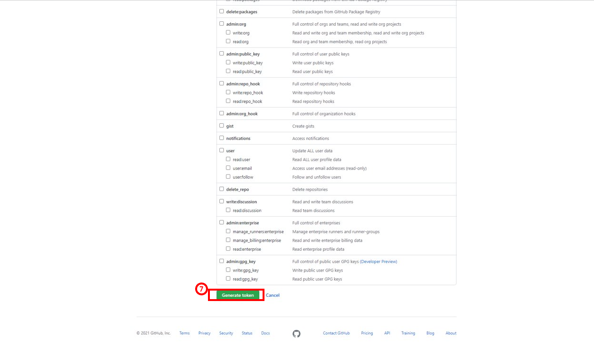
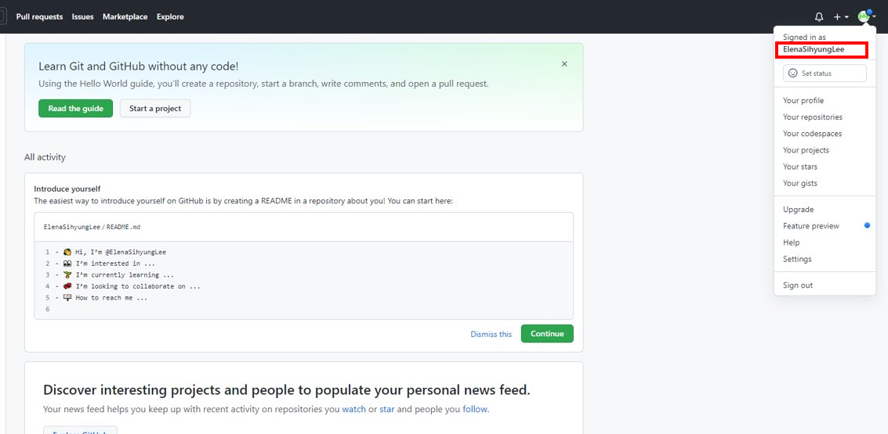
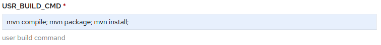
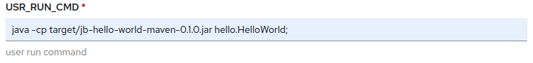

# java-source2build 사용 가이드

## 구성 요소 및 버전
* java 8 (https://www.oracle.com/java/technologies/javase/8u212-relnotes.html)
* maven (https://maven.apache.org/docs/3.8.3/release-notes.html)
* gradle (https://docs.gradle.org/7.2/release-notes.html)

## Prerequisites

### git repository

* java-source2build 사용하기 전 아래의 과정을 통해 사용자의 git repository 정보를 준비한다.

  * Case 1. 사용자의 git repository 가 public 인 경우
  
    
  
  * Case 2. 사용자의 git repository 가 private 인 경우 (Token 필요)
   
    

    

    

    

    

    

    * Case 2-1. github의 user ID
  
      

## GUI 생성 가이드

콘솔(개발자) > 서비스카탈로그(템플릿 인스턴스) > 템플릿 인스턴스 유형(클러스터 템플릿) > 템플릿(Kong-konga-template)

### Parameter 설명

* POD_NAME
  * Pod의 이름
  * Default value: java-s2b-pod
  
* GIT_REPO
  * 사용자의 git repository 
  * 위의 Prerequisites: Case 1 참조
  
* GIT_TOKEN
  * **private repository**일 경우에만 입력
  * private repository를 git clone 하기위한 token
  * 위의 Prerequisites: Case 2 참조
  
* GIT_ID
  * **private repository**일 경우에만 입력
  * github의 user ID
  * Prerequisites: Case 2-1 참조

* USR_BUILD_CMD
  * 빌드 시 필요한 command
  * build command 입력시 **각 커맨드 뒤에 꼭 ';' 붙여야 합니다**
  * ex) 

    

* USR_RUN_CMD
  * 실행 시 필요한 command
  * run command 입력시 **각 커맨드 뒤에 꼭 ';' 붙여야 합니다**
  * ex) 

    
