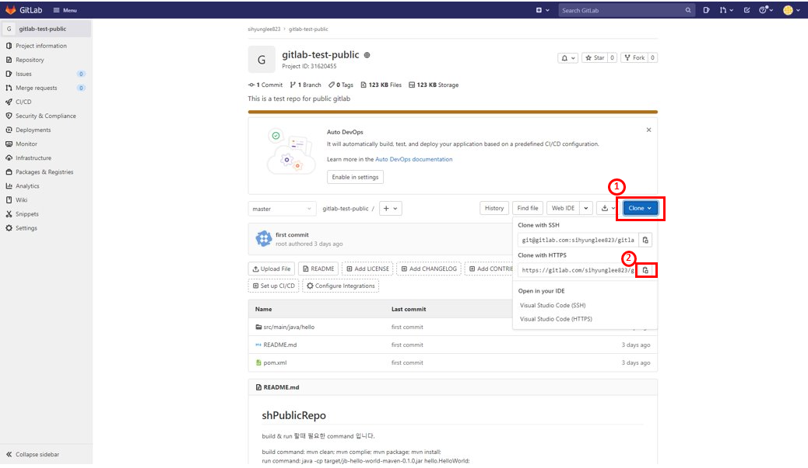
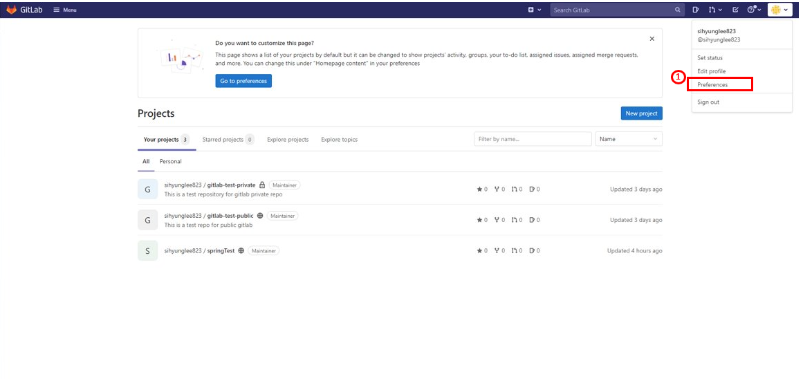
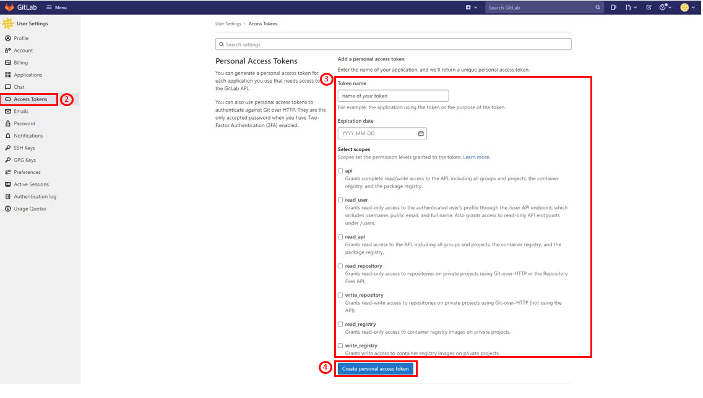
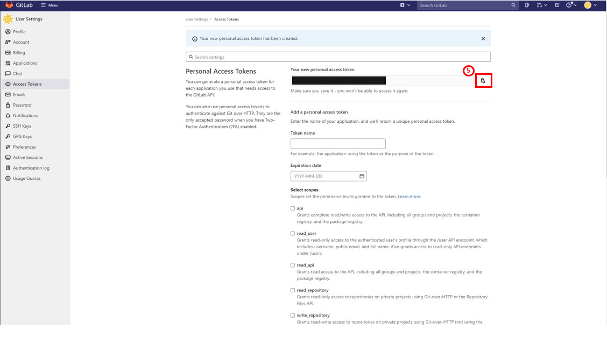
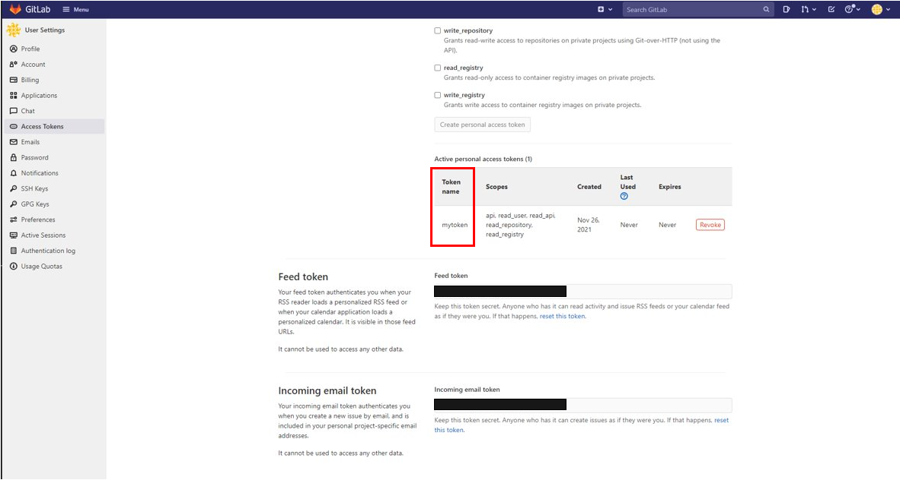
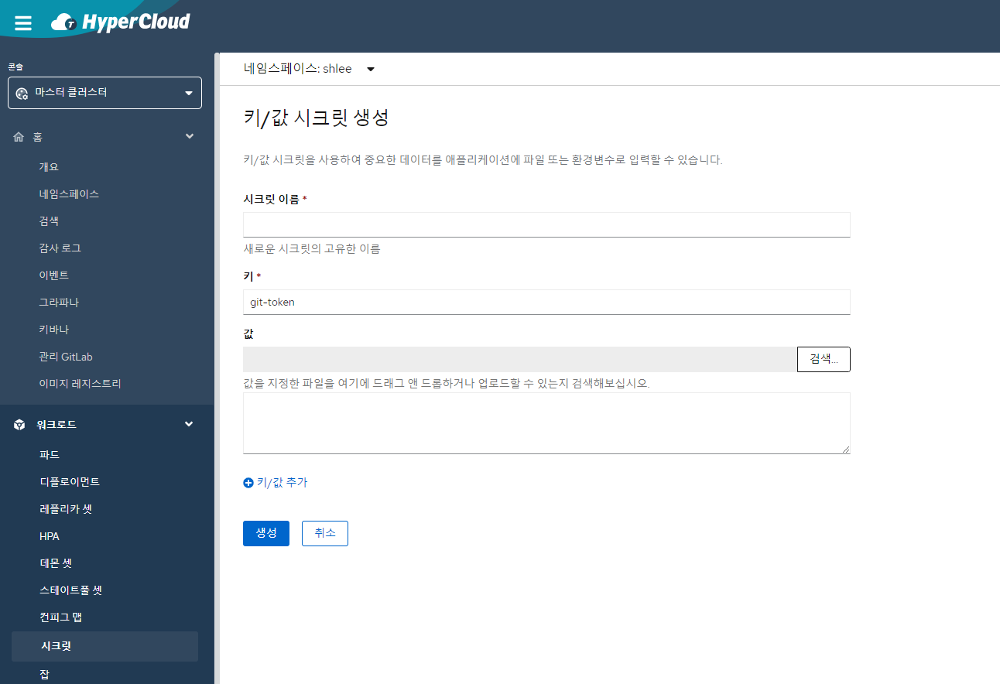

# java-source2build 사용 가이드

## 구성 요소 및 버전
* java 8 (https://www.oracle.com/java/technologies/javase/8u212-relnotes.html)
* maven (https://maven.apache.org/docs/3.8.3/release-notes.html)
* gradle (https://docs.gradle.org/7.2/release-notes.html)

## Prerequisites

### git repository

* java-source2build 사용하기 전 아래의 과정을 통해 사용자의 git repository 정보를 준비한다.

  * Case 1. GitHub
     
    * github repository 정보
      
      
  
    * github access token 발급
   
      

      

      

      

      

      

    * github user ID 

      

  * Case 2. GitLab
     
    * gitlab repository 정보
      
      
      
  
    * gitlab access token 발급
   
      

      

      

    * gitlab token name 

      

## GUI 생성 가이드

  * git token을 secret으로 생성
      
    hypercloud > 콘솔(마스터클러스터) > 워크로드(시크릿) > 키/값 시크릿 생성 > 시크릿 이름/키/값 입력 
      
    **키 값은 꼭 git-token 으로 입력하셔야 합니다**
      
    
       

  * 템플릿 생성
      
    콘솔(개발자) > 서비스카탈로그(템플릿 인스턴스) > 템플릿 인스턴스 유형(클러스터 템플릿) > 템플릿(java-s2b-template)
      

### Parameter 설명

* POD_NAME
  * Pod의 이름
  * Default value: java-s2b-pod
  
* GIT_REPO
  * 사용자의 git repository 
  * 위의 Prerequisites: Case 1 - github repo & Case 2 - gitlab repo 참조
  
* USR_SECRET_NAME
  * git clone 하기위한 token 정보를 포함한 시크릿의 이름
  * 위의 GUI 생성 가이드 참조
  * **public & private repository 상관없이 모두 입력 하셔야 합니다.**
  
* GITHUB_ID
  * **private repository**일 경우에만 입력
  * github의 user ID
  * 위의 Prerequisites: Case 1 - github user ID 참조

* GITLAB_TOKEN_NAME
  * **private repository**일 경우에만 입력
  * gitlab의 token name
  * 위의 Prerequisites: Case 2 - gitlab token name 참조

* USR_BUILD_CMD
  * 빌드 시 필요한 command
  * build command 입력시 **각 커맨드 뒤에 꼭 ';' 붙여야 합니다**
  * ex) 

    

* USR_RUN_CMD
  * 실행 시 필요한 command
  * run command 입력시 **각 커맨드 뒤에 꼭 ';' 붙여야 합니다**
  * ex) 

    

