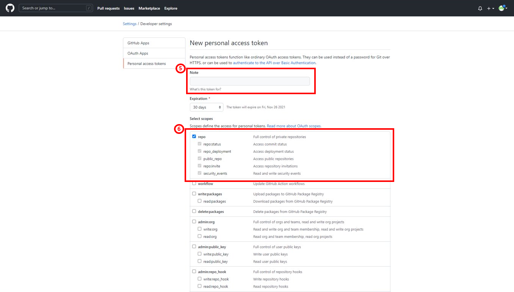

# java-source2build 사용 가이드

## Prerequisites

### git repository

* java-source2build 사용하기 전 아래의 과정을 통해 사용자의 git repository 정보를 준비한다.

  * Case 1. GitHub - public repository 일 경우
     
    * github repository 정보
      
      
  
  * Case 1-1. Github - private repository 일 경우
      
    * github repository 정보 : Case 1 과 동일
      
    * github access token 발급
      

      

      

      

      

      

    * github user ID 

      

  * Case 2. GitLab - public repository 일 경우
      
    * gitlab repository 정보

      
      
  * Case 2-1. Gitlab - private repository 일 경우
      
    * gitlab repository 정보 : Case 2 과 동일
      
    * gitlab access token 발급

      

      

      

    * gitlab token name 

      

## GUI 생성 가이드

  1. [**Private repository 일 경우에만 진행**] git access token을 secret으로 생성
      
    hypercloud > 콘솔(마스터클러스터) > 워크로드(시크릿) > 키/값 시크릿 생성 > 시크릿 이름/키/값 입력 
      
    **키 값은 꼭 git-token 으로 입력하셔야 합니다**
      
    
       

  2. 템플릿 인스턴스 생성
      
    콘솔 (개발자) > 서비스카탈로그 (템플릿 인스턴스) > 템플릿 인스턴스 유형 (클러스터 템플릿) > 템플릿 (java-s2b-template)
      
  
  3. 서비스 인스턴스 생성
      
    콘솔 (개발자) > 서비스카탈로그 (서비스 인스턴스) > java-s2b-template 선택 (클러스터 서비스 클래스) > 서비스 인스턴스 생성
      

### Parameter 설명

* POD_NAME
  * Pod의 이름
  * Default value: java-s2b-pod
    
* GIT_REPO
  * 사용자의 git repository 
  * 위의 Prerequisites: Case 1 - Github & Case 2 - Gitlab 참조
    
* USR_SECRET_NAME
  * **private repository**일 경우에만 입력
  * git clone 하기위한 token 정보를 포함한 시크릿의 이름
  * 위의 GUI 생성 가이드 1. 참조
    
* GITHUB_ID
  * **private repository**일 경우에만 입력
  * github의 user ID
  * 위의 Prerequisites: Case 1-1. github user ID 참조
  
* GITLAB_TOKEN_NAME
  * **private repository**일 경우에만 입력
  * gitlab의 token name
  * 위의 Prerequisites: Case 2-1. gitlab token name 참조
  
* USR_BUILD_CMD
  * 빌드 시 필요한 command
  * build command 입력시 **각 커맨드 뒤에 꼭 ';' 붙여야 합니다**
  * ex) 

    
  
* USR_RUN_CMD
  * 실행 시 필요한 command
  * run command 입력시 **각 커맨드 뒤에 꼭 ';' 붙여야 합니다**
  * ex) 

    
  
* JDK_VERSION
  * 실행 시 필요한 JDK 버전
  * 지원가능 한 JDK 버전 : 9, 10, 11, 12, 13, 14, 15, 16, 17
  
* MVN_VERSION
  * 프로젝트 빌드 시 필요한 MAVEN 버전
  * 지원가능 한 MAVEN 버전
    - maven 1: https://archive.apache.org/dist/maven/maven-1/
    - maven 2: https://archive.apache.org/dist/maven/maven-2/
    - maven 3: https://archive.apache.org/dist/maven/maven-3/
  
* GRADLE_VERSION
  * 프로젝트 빌드 시 필요한 GRADLE 버전
  * 지원가능 한 GRADLE 버전
    - https://services.gradle.org/distributions/