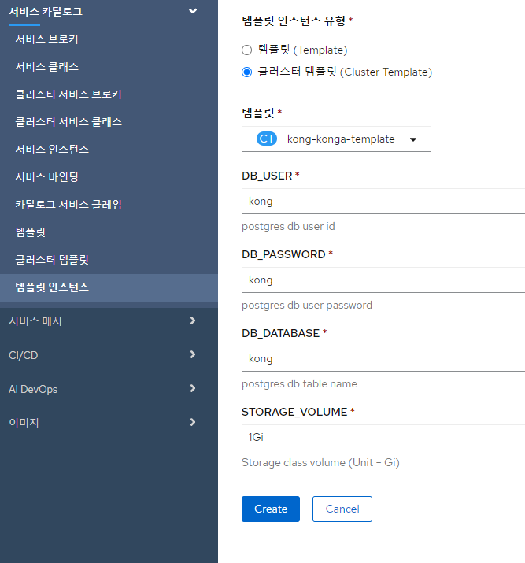
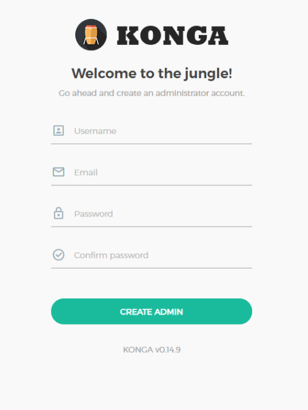
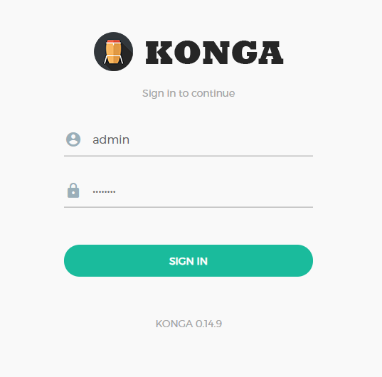
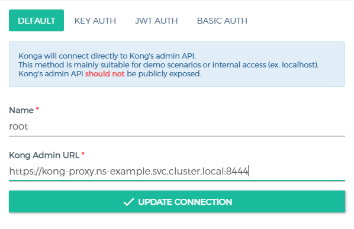
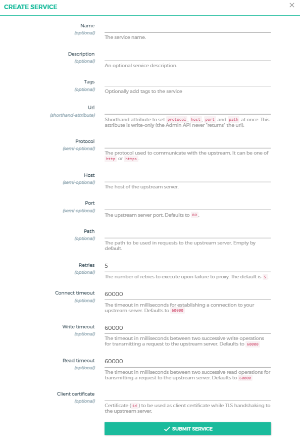
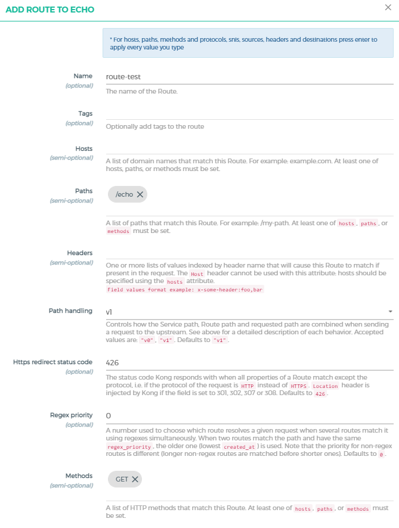

# Kong API Gateway With Konga

## 구성요소 및 버전

* Kong:2.5 (https://konghq.com/)
* Konga:0.14.9 (https://github.com/pantsel/konga)
* Postgres:9.6 (https://www.postgresql.org/)
* busybox:1.34.0 (https://busybox.net/)

## Prerequisites  

* k8s cluster

## GUI 생성 가이드


콘솔(개발자) > 서비스카탈로그(템플릿 인스턴스) > 템플릿 인스턴스 유형(클러스터 템플릿) > 템플릿(Kong-konga-template)
### __Parameters__

_주의)_  
_실행환경 내 StorageClass의 default가 지정되어 있어야 한다._  
_Namespace 당 하나의 인스턴스만 생성 가능_

* DB_USER  
  * postgres에 생성할 user ID  
* DB_PASSWORD  
  * postgres user password
* DB_DATABASE  
  * postgres db 이름 지정
* STORAGE_VOLUME  
  * db에 할당할 storage volume size 지정  




## Konga GUI 사용 가이드
  
  1. Konga 계정 생성 (http://konga-loadbalancer_EXTERNAL_IP)

     콘솔(마스터클러스터) > 네트워크(서비스) > konga-loadbalancer (namespace)
     
     konga-loadbalancer의 외부 로드밸런서위치(IP주소)를 입력하여 계정생성 페이지에 접속한다.

       
  #
  2. 생성한 계정으로 Konga 로그인

       
  #
  3. Kong API Gateway Connection 생성

     

     * NAME : 사용하고자 하는 Connection 이름을 원하는대로 지정  
     * Kong Admin URL : Kong-proxy의  External_IP 사용  
        - Protocol : https
        - Host : kong-proxy.__[사용중인 Namespace]__.svc.cluster.local
        - Port: 8444  
      #
  4. Service Resource 등록  
     연결 완료 후 좌측 TopDown 메뉴 SERVICES > ADD NEW SERVICE 클릭  
      
      
     


     * Name : 등록할 Service 이름 지정
     * Description : Service 요약 설명
     * URL : 등록하고자 하는 Service의 url 주소 입력
     * Protocol, Host, Port : URL 입력 시 입력 필요 X  
        
        ex). 임의로 생성해놓은 echo pod와 연결된 echo svc 등록
        ```bash
        $ kubectl get svc

        NAME       TYPE        CLUSTER-IP      EXTERNAL-IP   PORT(S)           AGE
        echo       ClusterIP   10.96.248.153   <none>        8080/TCP,80/TCP   5d23h
        ```
        -> URL : http://10.96.248.153:80
    
     서비스 생성 완료 후 생성된 서비스 클릭, Route 생성

     

     * Name : 등록할 Route 이름 지정
     * Path : 매핑할 Path 지정 (ex. /echo)
     * Method : 사용가능한 HTTP Method 지정  

     __Route 생성 완료 후 kong-propxy ip에 매핑된 /echo 를 통해서 외부에서 service 접근 가능__

## 추가) CLI 생성 가이드


1. Namespace 생성  

    ```bash
    $ kubectl create namespace ns-sample
    ```

    ns-sample 이라는 namespace가 생성된다. (원하는 namespace로 지정)

2. Cluster Template 적용

    ```bash
    $ kubectl apply -f kong-template.yaml
    ```


3. Template Instance 설정

    ```bash
    $ vim kong-instance.yaml
    ```
    kong-instance.yaml 파일 내부로 들어가 설정값을 적용한다.

    * __namespace__ : 생성한 namespace의 이름

    * __DB_USER__ : postgres에 생성할 user ID

    * __DB_PASSWORD__ : postgres user password

    * __DB_DATABASE__ : postgres db 이름 지정

    * __STORAGE_VOLUME__ : db에 할당할 storage volume 지정

    * __PG_PATH__ : db 경로 설정 (namespace와 동일한 값 지정)  


    ```bash
    apiVersion: tmax.io/v1
    kind: TemplateInstance
    metadata:
      name: kong-konga-template-instance
      namespace: ns-sample        #생성한 namespace value 지정
    spec:
      clustertemplate:
      metadata:
        name: kong-konga-template
      parameters:
      - name: DB_USER
        value: "kongid"           #id value 지정
      - name: DB_PASSWORD
        value: "kongpwd"          #pwd value 지정
      - name: DB_DATABASE
        value: "kongdb"           #dbName value 지정
      - name: STORAGE_CLASS
        value: csi-cephfs-sc      #storageClass value 지정
      - name: STORAGE_VOLUME
        value: 1Gi                #storageVolume value 지정
      - name: PG_PATH
        value: "ns-sample"        #postgresPath value 지정 (namespace와 동일한 값)
    ```

4. Template Instance 생성


    ```bash
    $ kubectl apply -f kong-instance.yaml
    ```

    pod, svc, pvc 생성완료 확인

    ```bash
    $ kubectl get pods -n ns-sample
    
    NAME                                READY   STATUS      RESTARTS   AGE
    kong-api-gateway-7fc478b874-fph8g   1/1     Running     0          3h49m
    kong-migrations-g48rp               0/1     Completed   0          3h49m
    konga-7678c55bb7-gsfwd              1/1     Running     2          3h49m
    postgres-0                          1/1     Running     0          3h49m

    ```

    ```bash
    $ kubectl get pvc -n ns-sample

    NAME                 STATUS   VOLUME   CAPACITY   ACCESS MODES   STORAGECLASS    
    datadir-postgres-0   Bound    pvc-e..  1Gi        RWO            csi-cephfs-sc   

    ```
    
    ```bash
    $ kubectl get svc -n ns-sample

    NAME                      TYPE           CLUSTER-IP      EXTERNAL-IP     PORT
    kong-proxy                LoadBalancer   10.96.110.198   192.168.9.160   80:30454/
    kong-validation-webhook   ClusterIP      10.96.102.222   <none>          443/
    konga-loadbalancer        LoadBalancer   10.96.99.180    192.168.9.161   80:32377/
    postgres                  ClusterIP      10.96.194.69    <none>          5432/

    ```

    konga-loadbalancer의 EXTERNAL-IP로 접속하여 Konga GUI 사용 가능  


