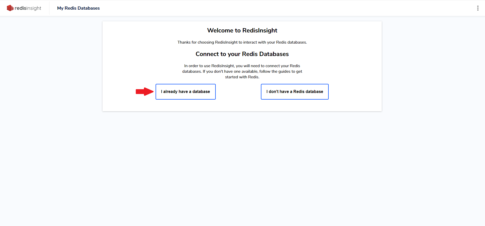
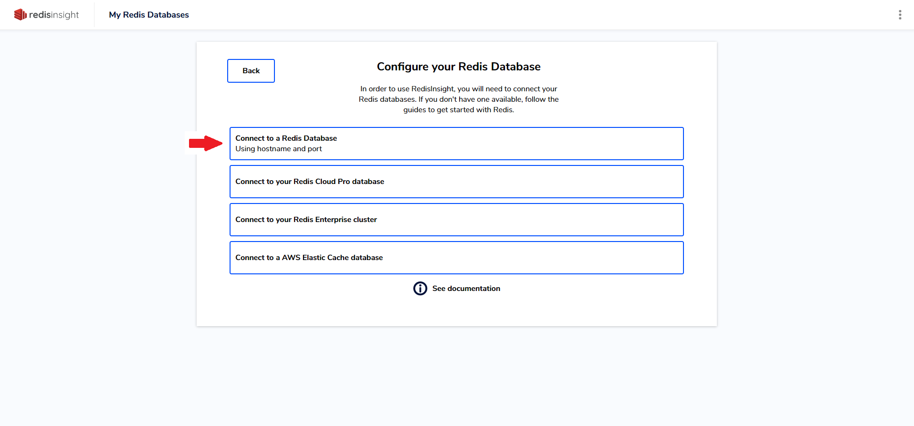
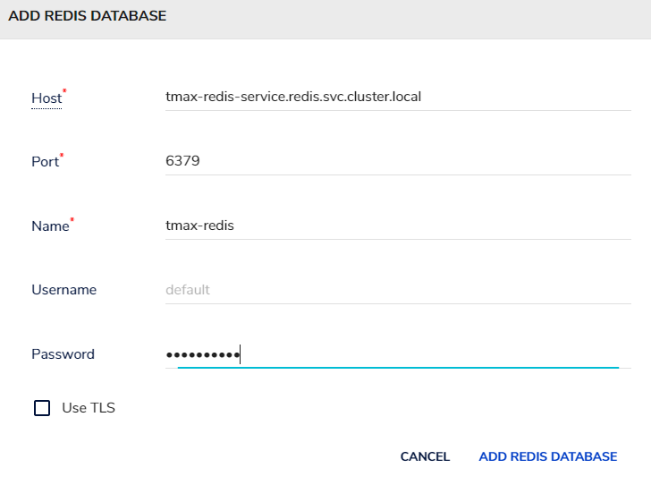
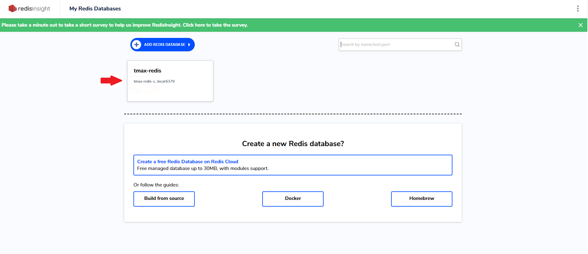
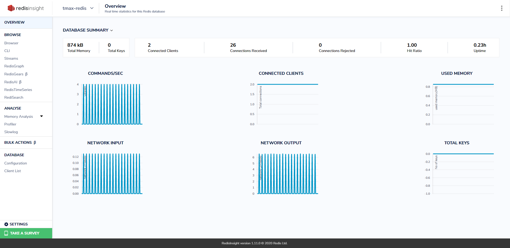

# Redis Template Guide

1. Template 생성
    ```bash
    kubectl apply -f redis-insight-template.yaml
    ```

2. TemplateInstance 생성
    ```bash
    kubectl apply -f redis-insight-instance.yaml
    ```

## Parameter 설명
- REDIS_INSIGHT_NAME
  - Redis insight 인스턴스의 이름, {REDIS_INSIGHT_NAME}-redis-insight의 형식으로 생성 됨
- SERVICE_TYPE
  - Redis insight의 서비스 타입, (ClusterIP, NodePort, LoadBalancer) 중 택1

## Redis Insight 사용법

1. Redis Insight 접속
    * 서비스 조회
    ```bash
    kubectl get service -n redis
    ```
    * 생성한 서비스 타입에 따라 알맞게 접속

2. Redis Database 연결
    * 비고
        * redis instance가 있다고 가정
    * I already have a database 클릭
          
    * Connect to a Redis Database 클릭
          
    * 정보 입력
        
        * Host
            * redis 서비스 DNS 주소, {서비스 이름}.{네임스페이스}.svc.cluster.local 형식
        * Port
            * redis 서비스 port (6379 고정)
        * Name
            * redis insight에서 부여할 이름
        * Username
            * redis에서 만든 이름, 기본적으로 생성하지 않기 때문에 생략하면 됨
        * Password
            * redis 비밀번호
    * 연결 성공 후 개요 화면
        
        
3. 사용법
    * 공식 문서
        - https://docs.redis.com/latest/ri/using-redisinsight/
